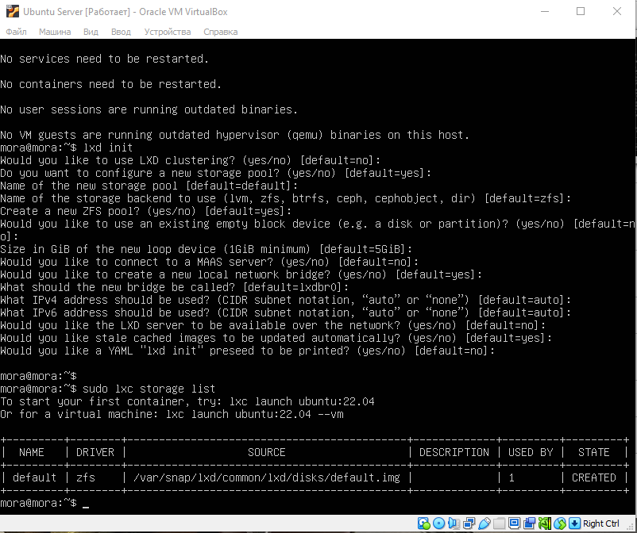
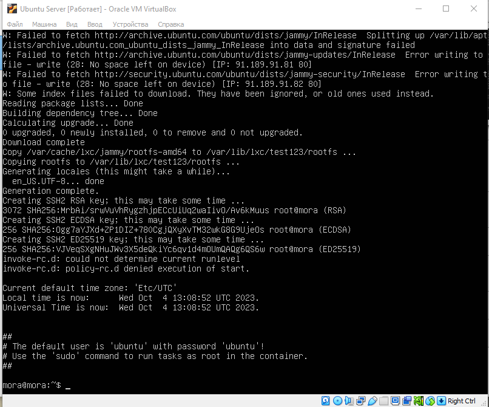
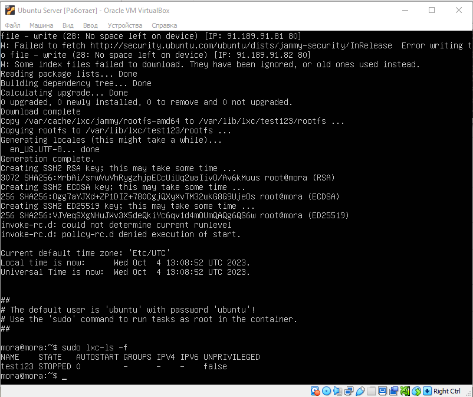
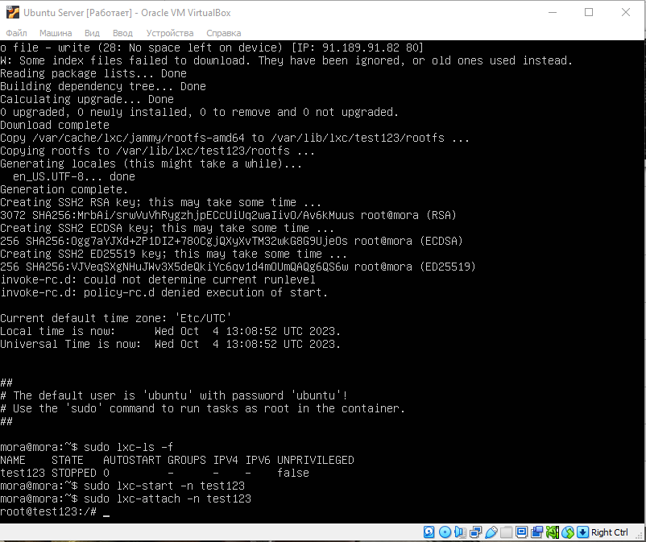
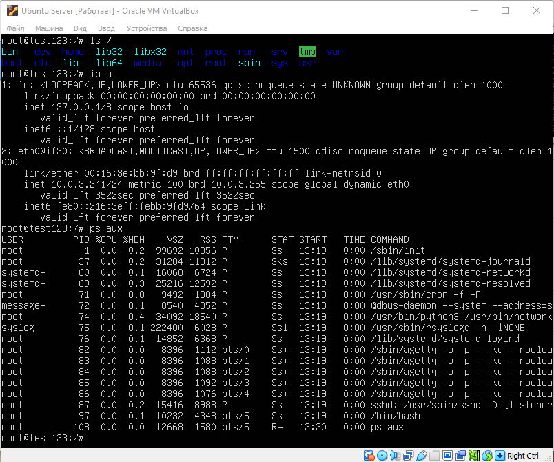
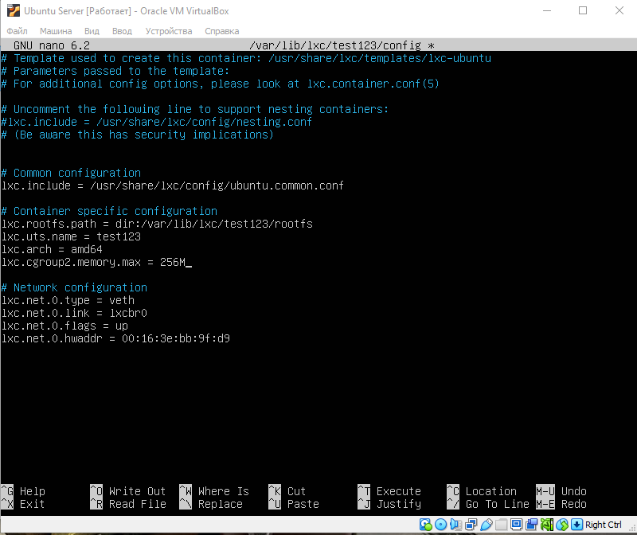
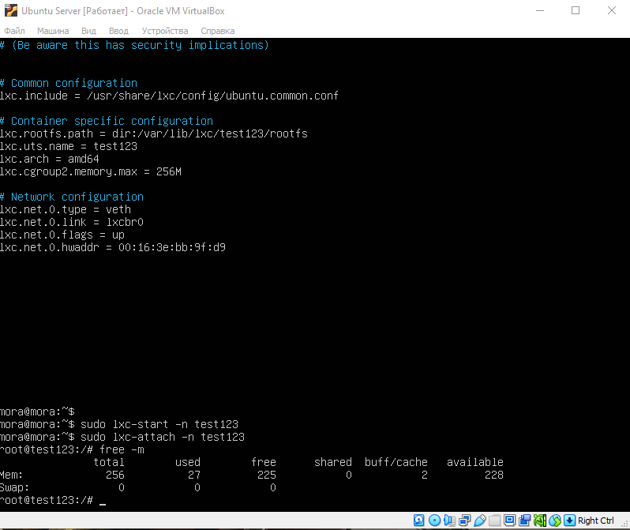
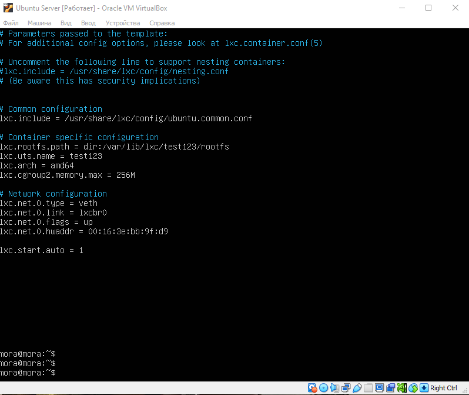
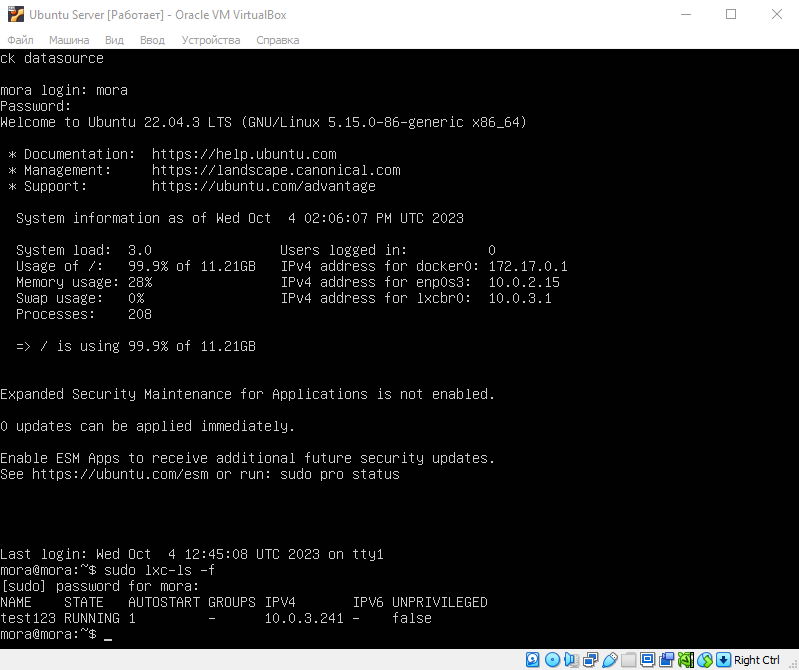

# Контейнеризация (семинары)


## Урок 2. Механизмы контрольных групп

### **Информация о проекте**

Задание 1:
1) запустить контейнер с ubuntu, используя механизм LXC;
2) ограничить контейнер 256 Мб ОЗУ и проверить, что ограничение работает;
3) добавить автозапуск контейнеру, перезагрузить ОС и убедиться, что контейнер действительно запустился самостоятельно;
4) при создании указать файл, куда записывать логи;
5) после перезагрузки проанализировать логи.

Задание 2*: настроить автоматическую маршрутизацию между контейнерами. Адреса можно взять: 10.0.12.0/24 и 10.0.13.0/24.

- Установка ЛКС:

``` bash
sudo apt update
sudo apt-get install lxc debootstrap bridge-utils lxc-templates
sudo apt-get install lxd-installer
sudo lxd init(Здесь просто нажимаем на Enter что уствновились значения по умолчанию)
Проверяем
sudo lxc storage list
```



- И создаем контейнер:

``` bash
sudo apt update
sudo lxc-create -n test123 -t ubuntu
```


Проверяем список контейнеров

``` bash
sudo lxc-ls -f
```



Запускаем контейнер и входим в него:

``` bash
sudo lxc-start -n test123
sudo lxc-attach -n teat123
```



Проверяем что мы в контейнере:



``` bash
sudo free -m — проверяем пямаять
exit - выходим
sudo lxc-stop -n test123 - закрываем контейнер
```

Заходить в конфигурационный файл и прописываем ограничение по памяти:

``` bash
nano /var/lib/lxc/test123/config - открываем конфиг файл
lxc.cgroup2.memory.max = 256M - ограничиваем память
```



Сохраняем, запускаем и входим в контейнер, проверяем память:

``` bash
sudo lxc-start -n test123
sudo lxc-attach -n teat123
sudo free -m
```



- Автозапуск:

Выходим из контейнера и закрываем его, открываем конфигурацию:

``` bash
exit - выходим
sudo lxc-stop -n test123 - закрываем контейнер
nano /var/lib/lxc/test123/config
lxc.start.auto = 1 - добавляем запись на автостарт
```



Перезагружаем систему и проверяем список контейнеров:



Автостарт сработал.

*Подготовила студентка Geek Brains* [**`Эрина Ксения`**](https://github.com/MoraKsu)